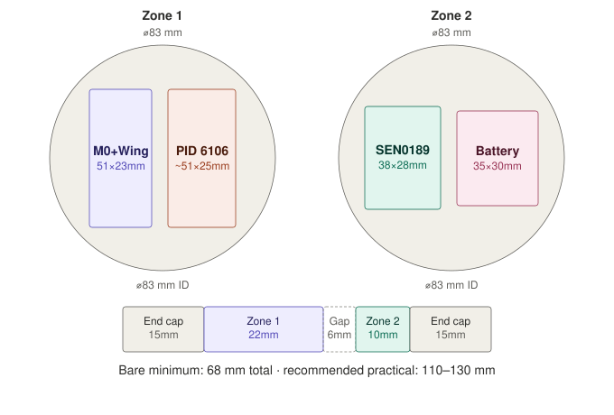

# Electronics Housing — Component Packing Budget

> **Summary** — First-pass geometric analysis of the Rev A electronics going inside the sealed
> electronics housing: real component dimensions pulled from Isabella's datasheets in
> [`hardware/datasheets/`](../../hardware/datasheets/), three candidate packing layouts, and the
> resulting minimum diameter/length/volume for each. **This is a packing estimate, not a
> structural or pressure-rating analysis** — wall thickness and depth rating are a separate
> question or a future pass. Feeds [`facts.md`](../hub/facts.md#build-platform-settled--see-adr-0001)'s
> Enclosure dimensions row and [SCO-49](https://linear.app/scout1/issue/SCO-49).
>
> Part of the [Knowledge Hub](../hub/README.md)'s supporting engineering docs, in the same spirit
> as [Buoy Mass and Buoyancy Budget](buoy-structural/mass-and-buoyancy-budget.md) — every
> mathematical step shown in full, every value tagged by provenance, calculated numbers replaced
> with real measurements as they become available.

---

## How to update this document

1. When a component's real dimensions become available (calipers on the physical part, a found
   manufacturer drawing), replace its **[A]** assumed value with a **[M]** measured one in
   [§1](#1-component-manifest) and re-run whichever packing method(s) use it.
2. If a packing method's governing dimension changes meaningfully, update
   [§5](#5-recommendation) and check whether the recommendation still holds.
3. If the team commits to a specific layout in CAD, log that in
   [`design-notes.md`](../hub/design-notes.md) and update
   [`facts.md`](../hub/facts.md#build-platform-settled--see-adr-0001)'s Enclosure dimensions row
   to cite the committed drawing instead of this estimate.

---

## 0. Provenance legend

Same convention as the [Buoy Mass and Buoyancy Budget](buoy-structural/mass-and-buoyancy-budget.md#0-provenance-legend):

| Tag | Meaning |
|---|---|
| **[M]** | Measured — read directly off a manufacturer datasheet/drawing on file in the repo |
| **[L]** | Literature — a well-established vendor standard (e.g. the FeatherWing form factor) not independently dimensioned in the repo's own copy |
| **[A]** | Assumption — stated explicitly, not yet verified against the real part |
| **[X]** | Exact — true by definition (e.g. a stated margin constant) |

## 1. Component manifest

Everything below is what the Rev A schematic ([`hardware/README.md`](../../hardware/README.md#confirmed-hardware-build-platform))
actually places inside the sealed dry bay — not the external, waterproof-rated probe tips, which
connect through cable glands and don't consume interior board volume.

| Component | L × W × H | Tag | Source |
|---|---|---|---|
| Feather M0 + RFM95 (Adafruit 3178) | 51 × 23 × 8 mm, 5.8 g | **[M]** | `hardware/datasheets/adafruit-feather-m0-radio-with-lora-radio-module.pdf` p.7 |
| Adalogger FeatherWing (Adafruit 2922) | 51 × 23 mm footprint (standard FeatherWing form factor) | **[L]** | Not independently dimensioned in `hardware/datasheets/adafruit-adalogger-featherwing.pdf`; FeatherWings share the Feather footprint by design |
| **Feather + Wing stack (combined)** | 51 × 23 mm footprint, **~22 mm tall** (M0 board + stacking headers + Wing board/components) | **[A]** | No repo source gives stack height; estimated from typical Feather stacking-header geometry |
| Adafruit PID 6106 (BQ25185 charger + TPS61023 boost) | **Unknown — assumed 51 × 25 × 10 mm** | **[A]** | ⚠️ Real gap, not an estimate choice — `hardware/datasheets/README.md` documents that only the bare BQ25185 chip datasheet is on file, not Adafruit's board-level guide. Measure the physical part the moment [SCO-88](https://linear.app/scout1/issue/SCO-88) lands |
| PKCELL LP503035 LiPo (500 mAh) | 35 × 30 × 5.0 mm + 100 mm lead to a JST PH-2P connector | **[M]** | `hardware/datasheets/pkcell-lp503035-lipo-battery.pdf` §11 battery pack drawing |
| SEN0189 turbidity adapter board | 38 × 28 × 10 mm (driver/potentiometer board only — the sensing probe itself is external) | **[M]** | `hardware/datasheets/dfrobot-sen0189-turbidity-sensor.pdf` p.2 |
| DS18B20 waterproof probe (Adafruit 3846) | External, cable enters through a gland — negligible interior volume | — | — |
| Antenna | No onboard antenna. Either a **78 mm wire whip** (needs interior routing) or a **uFL+SMA bulkhead** (needs a housing penetration) | **[M]** | `hardware/datasheets/adafruit-feather-m0-radio-with-lora-radio-module.pdf` p.24 (915 MHz quarter-wave = 3 in / 7.8 cm) |
| Wiring, 10 kΩ/20 kΩ divider, connectors | Small parts — absorbed into the margin constants in [§2](#2-margin-constants), not modeled individually | **[A]** | — |

**Two constraints worth flagging before the geometry:**

- **SEN0189's own datasheet states "the top of probe is not waterproof."** Only the immersed
  sensing tip is rated for submersion — the adapter board and the cable-to-probe transition both
  need to stay inside the dry bay, same as every other board here.
- **PID 6106's assumed footprint is the single biggest source of uncertainty in this document.**
  It happens to govern the minimum diameter in [§3](#3-method-1--axial-stack) below — if the real
  board is meaningfully bigger, re-run that method first.

## 2. Margin constants

Held constant across all three methods so they're comparable:

| Constant | Value | Tag | Purpose |
|---|---|---|---|
| Radial clearance | 8 mm, added to any bounding diagonal | **[A]** | Standoffs, wall clearance, wiring space |
| Axial gap | 6 mm, between adjacent zones/slices | **[A]** | Physical separation, wire pass-through |
| End-cap allowance | 15 mm, each end | **[A]** | Cable gland bosses, heat-set insert bosses |

## 3. Method 1 — Axial stack

Each board perpendicular to the tube's axis, one board per "slice," stacked front-to-back.
Minimum diameter per slice = diagonal of the board's footprint + radial clearance.

```
Feather+Wing:  diagonal = sqrt(51² + 23²) = sqrt(2601 + 529)  = 55.9 mm → D = 63.9 mm
PID6106 [A]:   diagonal = sqrt(51² + 25²) = sqrt(2601 + 625)  = 56.8 mm → D = 64.8 mm  ← governs
SEN0189:       diagonal = sqrt(38² + 28²) = sqrt(1444 + 784)  = 47.2 mm → D = 55.2 mm
Battery:       diagonal = sqrt(35² + 30²) = sqrt(1225 + 900)  = 46.1 mm → D = 54.1 mm
```

| Result | Value | Tag |
|---|---|---|
| **Governing diameter** | **65 mm** (PID6106 slice) | [A] |
| Length | 22 + 10 + 10 + 5 (thicknesses) + 3×6 (gaps) + 2×15 (end allowances) = **98 mm** | [A] |
| **Volume** | π × 32.5² × 98 = **325,100 mm³ ≈ 0.325 L** | [X] (Archimedes-style, exact given the inputs) |

Smallest volume and slimmest diameter of the three methods, at the cost of the longest tube.

## 4. Method 2 — Single flat layer

All four boards side by side on one tray, occupying a single axial position. Best 2×2 grid
arrangement found (Feather+Wing and PID6106 sharing one row at their 51 mm long edge; SEN0189
and battery sharing a second row):

```
Row 1 width  = 23 + 25 + 6 (gap) = 54 mm,  row 1 height = 51 mm
Row 2 width  = 28 + 30 + 6 (gap) = 64 mm,  row 2 height = 38 mm
Bounding rectangle: 64 mm × (51 + 6 + 38) = 64 × 95 mm
Diagonal = sqrt(64² + 95²) = sqrt(4096 + 9025) = sqrt(13121) = 114.5 mm → D = 122.5 mm
```

| Result | Value | Tag |
|---|---|---|
| **Governing diameter** | **123 mm** | [A] |
| Length | 22 (tallest board) + 3 (tray) + 5 (clearance) + 2×15 (end allowances) = **60 mm** | [A] |
| **Volume** | π × 61.5² × 60 = **711,400 mm³ ≈ 0.711 L** | [X] |

Shortest tube of the three, but **needs a bigger diameter than the ~4″ Schedule 40 PVC reference
already assumed in [`mechanical/README.md`](../../mechanical/README.md)** — and pays heavily for
it, since volume scales with the *square* of radius but only linearly with length. A tighter,
non-grid nesting of the four boards could shrink this diameter, but that needs real CAD placement,
not hand geometry — flagged as an open item in [§6](#6-open-items).

## 5. Method 3 — Two-zone hybrid

Feather+Wing paired with PID6106 in zone 1; SEN0189 paired with the battery in zone 2. Each pair
sits side by side within its zone; the two zones stack along the tube's axis.

```
Zone 1: width = 23 + 25 + 6 = 54 mm, height = 51 mm (shared long edge)
        diagonal = sqrt(54² + 51²) = sqrt(2916 + 2601) = sqrt(5517) = 74.3 mm → D = 82.3 mm
        zone thickness = max(22, 10) = 22 mm (Feather+Wing stack governs)

Zone 2: width = 28 + 30 + 6 = 64 mm, height = 38 mm
        diagonal = sqrt(64² + 38²) = sqrt(4096 + 1444) = sqrt(5540) = 74.4 mm → D = 82.4 mm
        zone thickness = max(10, 5) = 10 mm (SEN0189 board governs)
```

| Result | Value | Tag |
|---|---|---|
| **Governing diameter** | **83 mm** (both zones land within 1 mm of each other) | [A] |
| Length | 22 + 6 (gap) + 10 + 2×15 (end allowances) = **68 mm** | [A] |
| **Volume** | π × 41.5² × 68 = **367,800 mm³ ≈ 0.368 L** | [X] |

### Diagram

Drawn to scale from the numbers above — the `~51×25mm` label on PID 6106 keeps that assumption
visible in the diagram itself, since it's still waiting on a caliper (see
[§6](#6-open-items)):



Character version, for anyone reading this in a plain-text diff:

```
ELECTRONICS HOUSING — TWO-ZONE HYBRID PACKING (Method 3)

  ZONE 1 cross-section                    ZONE 2 cross-section
  (⌀83mm ID)                              (⌀83mm ID)

      .-----------------.                     .-----------------.
    /                     \                  /                     \
   /   +-------+ +-------+ \                /  +------+ +--------+  \
  |    |M0+Wing| |PID6106| |                |  |SEN0189| |Battery |  |
  |    |51x23mm| |~51x25 | |                |  |38x28mm| |35x30mm | |
  |    |  mm   | |  mm   | |                |  |       | |        | |
  |    +-------+ +-------+ |                |  +------+ +--------+  |
   \                      /                  \                     /
    \                    /                    \                   /
      '----------------'                        '----------------'

AXIAL VIEW (side profile, cylinder length)

   +--------+-------------+------+----------+--------+
   |  end   |   ZONE 1    | gap  |  ZONE 2  |  end   |
   |  cap   | M0+Wing +   |  --  | SEN0189 +|  cap   |
   | (gland)|  PID 6106   |      | Battery  |(gland) |
   | 15 mm  |   22 mm     | 6 mm |  10 mm   | 15 mm  |
   +--------+-------------+------+----------+--------+
   |<---------------- 68 mm bare minimum ------------------>|
   |<------------ 110-130 mm practical target -------------------->|
```

## Comparison

| Method | Diameter | Length | Volume | Fits the ~102 mm (4″) PVC reference? |
|---|---|---|---|---|
| 1 — Axial stack | 65 mm | 98 mm | 0.325 L | Yes, 37 mm to spare |
| 2 — Single flat layer | 123 mm | 60 mm | 0.711 L | **No** — 21 mm over |
| 3 — Two-zone hybrid | 83 mm | 68 mm | 0.368 L | Yes, 19 mm to spare |

## 6. Recommendation

**Method 3.** It's within 13% of Method 1's volume, a third shorter, and — the useful part —
**fits inside the existing ~4″ Schedule 40 PVC reference (102 mm ID) with real margin to spare**,
so it doesn't force a change to the mechanical direction already documented in
[`mechanical/README.md`](../../mechanical/README.md). Method 2 would force a diameter increase
for a length saving that costs more in volume than it gains. Method 1 is the most
volume-efficient on paper but produces a notably long, thin tube for a modest volume benefit over
Method 3.

**This is a floor, not a target.** The bare-minimum computed length (68 mm) leaves no slack for
hand-assembly, the battery's 100 mm JST lead (route it coiled in the zone gaps, not as dedicated
length), or the still-open antenna decision. A **practical internal length of ~110–130 mm at the
existing ~100 mm diameter** is what this recommends actually designing to, not the bare 68 mm
minimum.

**Explicitly out of scope here:** wall thickness and pressure rating at depth. This document
covers internal (ID) packing only — the OD and structural margin are a separate question, closer
to the FEA/proof-load work tracked on [SCO-71](https://linear.app/scout1/issue/SCO-71) and
[SCO-82](https://linear.app/scout1/issue/SCO-82) than to this one.

## 7. Open items

- **PID 6106 real dimensions** — the single biggest uncertainty in this document; governs
  Method 1's diameter outright. Measure on arrival ([SCO-88](https://linear.app/scout1/issue/SCO-88)).
- **Antenna decision** — internal wire whip (needs routing space, already assumed absorbed into
  the zone gaps above) vs. uFL+SMA bulkhead (needs a housing wall penetration, a new waterproofing
  interface not accounted for in any method above). Not yet decided.
- **Feather+Wing stack height (~22 mm)** is an estimate, not a measurement — worth confirming
  once the hardware is physically stacked.
- **Tighter Method 2 packing** — a real CAD nesting (not a hand-computed grid) could plausibly
  bring Method 2's diameter down closer to the PVC reference; not attempted here.
- **Wall thickness / pressure rating** — deliberately not covered; see [§6](#6-recommendation).
