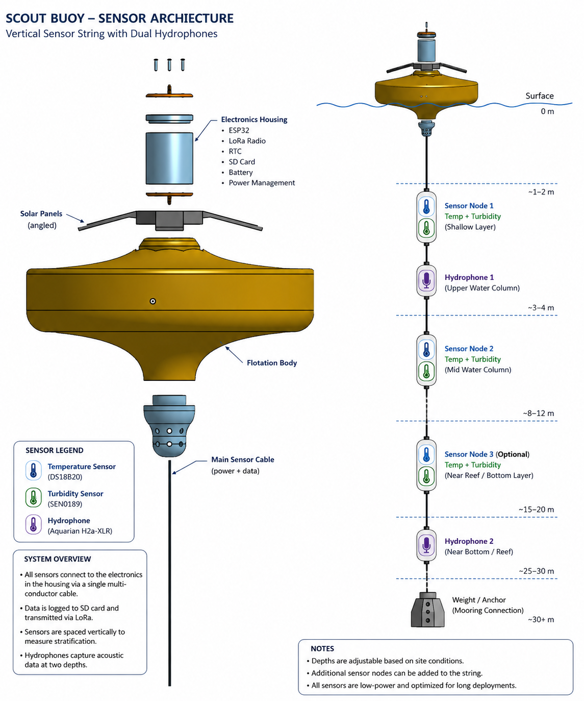

# Vertical Sensor String Architecture

> **Summary** — Modular vertical sensor string suspending temperature, turbidity, and hydrophone nodes at multiple depths beneath the buoy, keeping the main electronics bay sealed above the waterline.
>
> **Source document** — `Vertical Sensor String Architecture.docx`

> 🔭 **Future concept — not the current build.** Per
> [ADR-0003](../decisions/0003-single-point-sensing.md) (2026-08-14), the capstone build uses
> **one sensor of each modality at a single point** beneath the buoy, with extra units held as
> spares. This multi-depth string is retained as a documented direction for a future revision.

---

## Concept

The sensor string keeps all primary electronics in a single sealed enclosure at the surface
and distributes sensing elements down a multi-conductor cable. This enables multi-depth
measurement (thermoclines, turbidity stratification) while keeping the serviceable
electronics dry and accessible.



## String layout

```text
SURFACE
┌──────────────────────────┐
│ Solar / Antenna / Float   │
└────────────┬──────────────┘
             │
┌────────────▼──────────────┐
│ Sealed Electronics Bay    │
│ Feather M0 / SD / LoRa/RTC│
│ Battery / Audio Logger    │
└────────────┬──────────────┘
             │
      Main sensor cable
             │
┌────────────▼──────────────┐
│ Sensor Node 1             │
│ Temp + Turbidity          │
│ Shallow water layer       │
└────────────┬──────────────┘
             │
        Hydrophone 1
   near buoy / upper reef sound
             │
┌────────────▼──────────────┐
│ Sensor Node 2             │
│ Temp + Turbidity          │
│ Mid-water layer           │
└────────────┬──────────────┘
             │
┌────────────▼──────────────┐
│ Sensor Node 3 (optional)  │
│ Temp + Turbidity          │
│ Near reef / bottom layer  │
└────────────┬──────────────┘
             │
        Hydrophone 2
   near bottom / reef soundscape
             │
          Weight
             │
       Mooring line
```

## Component placement

| Component | Location | Purpose |
|---|---|---|
| Temp + turbidity pair 1 | Shallow / near buoy | Measures surface-layer heat and sediment |
| Hydrophone 1 | Upper cable | Captures near-surface sound: boats, wave noise, human activity |
| Temp + turbidity pair 2 | Mid-depth | Measures stratification through the water column |
| Temp + turbidity pair 3 | Near bottom (optional) | Measures reef-level conditions |
| Hydrophone 2 | Bottom of cable | Captures reef soundscape closer to fish/coral habitat |

## Design rationale

- All sensors connect to the electronics housing via a single multi-conductor cable.
- Data is logged to onboard storage and summarized data transmitted via LoRa.
- Sensors are spaced vertically to measure stratification.
- Hydrophones capture acoustic data at two depths.
- Sensor nodes are modular and individually replaceable.

## Open items

- **Deployment depth is 2–7 m** (revised 2026-08-14, was 5–8 m), confirmed against the actual
  Hawaii site — see [SCO-6](https://linear.app/scout1/issue/SCO-6). The `~30 m` annotation on
  the diagram image is outdated. The diagram PNG should be re-exported to drop the ~30 m label.
- **Hydrophone part number differs across documents.** The diagram cites the Aquarian
  H2a-XLR; the [Engineering Design Document](engineering-design-document.md) BOM specifies
  the Aquarian H2dM.
- The source diagram image contains a typo in its title ("ARCHIECTURE"). Preserved as-is
  since it is the original artwork.
