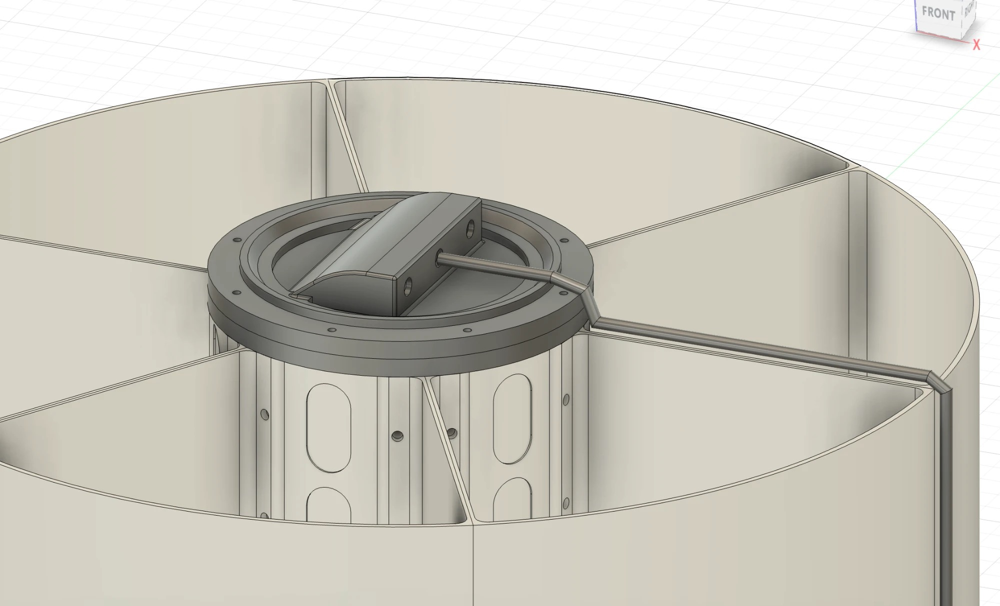

# Electronics Housing

CAD models for the sealed electronics bay enclosure (MCU, battery, radio, logger).

> ✅ **Baseline declared 2026-09-02 (John Ryan): the face-seal clamp is the current electronics
> housing.** [`electronics-housing-clamp-v2-body.step`](electronics-housing-clamp-v2-body.step)
> + [`electronics-housing-clamp-v2-lid.step`](electronics-housing-clamp-v2-lid.step) supersede the
> end-cap-slides-into-cylinder arrangement below. Everything else in this folder is now
> **iteration history**, including [`electronics-housing-body.step`](electronics-housing-body.step)
> — which is dimensioned for the old scheme and does not mate to the clamp. See
> [Static face-seal clamp](#static-face-seal-clamp--2026-09-02), and
> [SCO-68](https://linear.app/scout1/issue/SCO-68) for reconciling the body/end-cap CAD to it.

## Current components

| File | Role | Status |
|---|---|---|
| [`electronics-housing-clamp-v2-body.step`](electronics-housing-clamp-v2-body.step) | Sealing clamp body ("Clamp 2 AS568-043") — carries the AS568-043 static face-seal groove and the 6-bolt pattern, bolts **outside** the seal boundary | **Current** |
| [`electronics-housing-clamp-v2-lid.step`](electronics-housing-clamp-v2-lid.step) | Mating lid, with the engraved identifying marking on its top face (wording recorded below, decided 2026-09-08). ⚠️ No bolt clearance holes as exported ([SCO-107](https://linear.app/scout1/issue/SCO-107)) | **Current** |
| [`electronics-housing-o-ring.step`](electronics-housing-o-ring.step) | O-ring seal, modeled directly | Reference |
| [`electronics-housing-body.step`](electronics-housing-body.step) | Chassis cylinder body ("Full Print Body Upper") — **superseded 2026-09-02**, dimensioned for the end-cap scheme | Iteration |
| [`electronics-housing-endcap-no-port.step`](electronics-housing-endcap-no-port.step) | End cap that slides into and seals the chassis cylinder ("Top-Bottom No Port") — **superseded 2026-09-02** | Iteration |
| [`electronics-housing-top-fitting.step`](electronics-housing-top-fitting.step) | Waterproof top fitting ("Body Upper") — **printed and physically tested**, validated heat-set insert M4 fastening and lid fit. **Superseded 2026-09-02** as the sealing design, but its heat-set-insert result still stands | Iteration |
| [`electronics-housing-tpu-ring.step`](electronics-housing-tpu-ring.step) | TPU-printed O-ring experiment — closed out by the [2026-08-17 O-ring decision](../../../docs/hub/decision-log.md) (off-the-shelf rings) | Iteration |

John Ryan has also considered **printed injection molds** to batch-cast O-rings in-house rather
than sourcing off-the-shelf — not pursued, and the
[2026-08-17 decision](../../../docs/hub/decision-log.md) went the other way, but it stays a live
option consistent with the project's in-house-additive approach (see
[floatation → Manufacturing approach](../floatation/README.md)).

## Superseded assembly — end cap into cylinder

- [`electronics-housing-body.step`](electronics-housing-body.step) — 3D-printed chassis
  cylinder body ("Full Print Body Upper")
- [`electronics-housing-endcap-no-port.step`](electronics-housing-endcap-no-port.step) — end
  cap that slides into and seals the chassis cylinder ("Top-Bottom No Port")
- [`electronics-housing-top-fitting.step`](electronics-housing-top-fitting.step) — the
  **waterproof top fitting** ("Body Upper"). **Printed and physically tested**: validated
  heat-set insert M4 fastening and lid fit.
- [`electronics-housing-tpu-ring.step`](electronics-housing-tpu-ring.step) — a **TPU-printed
  O-ring experiment**. John Ryan has also considered **printed injection molds** to batch-cast
  his own O-rings in-house, rather than sourcing off-the-shelf — not yet pursued, but a live
  option consistent with the project's in-house-additive manufacturing approach (see
  [floatation → Manufacturing approach](../floatation/README.md)).
- [`electronics-housing-o-ring.step`](electronics-housing-o-ring.step) — the housing's O-ring
  seal, modeled directly (as opposed to the TPU-print experiment above).
- [`electronics-housing-clamp-v2-body.step`](electronics-housing-clamp-v2-body.step) — **the
  current sealing clamp body** ("Clamp 2 AS568-043", 2026-09-02). Carries the AS568-043 static
  face-seal groove and the 6-bolt pattern, with the bolts moved **outside** the seal boundary.
  See [below](#static-face-seal-clamp--2026-09-02).
- [`electronics-housing-clamp-v2-lid.step`](electronics-housing-clamp-v2-lid.step) — **the
  mating lid** for that clamp, carrying John Ryan's engraved identifying marking on its top
  face.

## Assembly

**Superseded 2026-09-02** by the face-seal clamp, and kept here as the record of what was
actually built and tested. The end cap slid into the printed chassis cylinder and was secured with
**heat-set insert M4 bolts and washers**, waterproofed by **rubber sealing washers** at the bolt
joints — every fastener passing through the sealed boundary, which is exactly the arrangement
the design panel review flagged and the clamp replaces.

**Not yet built to this spec.** The [2026-08-24 submersion test](../../test/waterproofing-submersion-test-2026-08-24.md)
tested a physical electronics housing with **no rubber sealing washers at the bolt joints** —
bare bolt-into-cavity contact — and it failed with significant water ingress, as expected for
that build. This confirms the gap rather than the design: the documented spec above hasn't
actually been validated yet, only a version without it.

**Not final:** the current cap has a shackle/connection point in place of a cable entry. The
final design replaces that with a **cable gland** (matches the cable-entry method already
specified in [`mechanical/README.md`](../../README.md#design-baseline)) — this STEP is a
placeholder for that geometry, not the build spec.

Dimensions are still TBD for CAD purposes, but a first-pass packing analysis
(2026-08-25) gives a recommended target — see
[Electronics Housing Packing Budget](../../../docs/engineering/electronics-housing-packing-budget.md)
and [`docs/hub/facts.md`](../../../docs/hub/facts.md#build-platform-settled--see-adr-0001).
Recommended: **~⌀100 mm × 110–130 mm internal**, fitting inside the existing ~4" PVC reference
with margin. Two things that packing analysis flags as still open and relevant to CAD:

- **The Adafruit PID 6106 charger/boost board's real dimensions aren't known yet** — the packing
  budget uses an assumed 51 × 25 × 10 mm footprint. Confirm against the physical part once
  [SCO-88](https://linear.app/scout1/issue/SCO-88) lands before committing internal mounting
  geometry to it.
- **Antenna routing isn't decided** — an internal wire whip (no housing penetration, needs
  routing space) vs. a uFL+SMA bulkhead connector (a housing penetration, a new waterproofing
  interface not modeled in the current O-ring/cable-gland design). This changes the endcap
  design, not just internal layout.

## Static face-seal clamp — 2026-09-02

**Change (John Ryan).** The electronics housing's sealing joint was reworked into a **static
face seal**, applying the same approach already taken on the
[sensor pod](../sensor-housing/README.md#face-seal-remodel--2026-08-29) two weeks earlier. Three
things changed together:

- **Fasteners moved outside the O-ring boundary.** The 6 bolts now sit on a **Ø104.14 mm bolt
  circle**, radially **~6.2 mm outboard of the groove OD** (Ø91.69 mm). Every fastener is
  therefore outside the sealed region rather than piercing it. This is a direct fix for the
  **[design panel review](../../../docs/engineering/reviews/buoy-preliminary-design-panel-review-2026-08.md)**
  finding that "fasteners currently sit inside the O-ring boundary, turning every one into a
  potential leak path" — tracked on
  [SCO-68](https://linear.app/scout1/issue/SCO-68). It also means the bolt joints no longer
  need the rubber sealing washers that the older
  [bolt-through design](#superseded-assembly--end-cap-into-cylinder) depends on, and whose absence is what the
  [2026-08-24 submersion test](../../test/waterproofing-submersion-test-2026-08-24.md)
  article failed on.
- **Groove dimensions aligned to a standard O-ring.** The groove is cut for an **AS568-043**
  ring (1/16" series, 0.070" / 1.78 mm cross-section) rather than to an arbitrary size — see
  the numbers below.
- **Reinforced, fully-contacting seal faces.** The land outboard and inboard of the groove is
  designed to **bottom out metal-to-metal (PETG-to-PETG)** at full assembly, so O-ring squeeze
  is set by the geometry and not by fastener torque, and the flange is stiff enough that
  bolt-to-bolt bowing does not locally relieve the compression. Same reasoning as the sensor
  pod remodel.

**Geometry (read from the STEP, confirm against the drawing).**

| Feature | Value |
|---|---|
| Clamp body height | 118.11 mm (4.650") |
| Body OD | Ø114.30 mm (4.500"), from z 6.35 mm upward |
| Bottom spigot | Ø101.60 mm (4.000") × 6.35 mm tall, 45° flare out to the body OD |
| Top bore | Ø78.74 mm (3.100"), z 107.95 → 118.11 mm, with a 45° relief at Ø86.36 mm |
| Seal face | the z = 118.11 mm top face |
| Face-seal groove | ID Ø86.87 mm / OD Ø91.69 mm → **2.413 mm wide × 1.372 mm deep** |
| Bolt pattern | 6 × Ø5.588 mm (0.220") blind holes, **7.62 mm deep**, on a **Ø104.14 mm** bolt circle, 60° apart |
| Lid | Ø114.30 mm × 6.35 mm (0.250") thick, 45° × 0.635 mm top-edge chamfer |
| Lid marking | engraved **1.27 mm (0.050") deep** into the top face, four lines |

**The O-ring check passes.** Against the AS568-043 cross-section (1.78 mm):

- **Squeeze** = (1.78 − 1.372) / 1.78 = **22.9 %** — inside the 15–30 % band for a static face
  seal.
- **Gland fill** = ring area 2.49 mm² / groove area 3.31 mm² = **75 %** — inside the usual
  60–85 % band, leaving room for thermal expansion and compression set.

So "aligned dimensions with standard o ring" checks out on the two numbers that matter. What is
**not** yet confirmed is the ring's *diameter* fit: the groove ID is Ø86.87 mm, and the
AS568-043 free ID needs to sit between that and the groove OD (Ø91.69 mm) so internal pressure
seats the ring against the outer groove wall. Verify against a supplier table before ordering,
and pick the elastomer while you're there — [SCO-106](https://linear.app/scout1/issue/SCO-106).

**Printed, and it needs a reprint.** John printed this revision and found **slight O-ring
tolerance issues** — reprint pending. The specific dimension at fault is not yet recorded here;
capture it on the reprint so the groove numbers above can be corrected rather than re-guessed
— [SCO-105](https://linear.app/scout1/issue/SCO-105).

**Identifying marking.** The lid's top face carries engraved identifying language (four lines,
1.27 mm deep). The STEP stores it as tessellated glyph geometry, not as a text string, so the
exact wording is not recoverable from the file — **recorded here so a future print can be
reproduced from the repo alone** (decided 2026-09-08, [SCO-107](https://linear.app/scout1/issue/SCO-107)):

```
S.C.O.U.T.
SCU Senior Design 2026–2027
+1 808-745-0769
IR · JRM · DCC
```

(project name · program + academic year · a contact phone number · the three team members'
initials — Isabella Rodriguez, John Ryan Myrdal, David Chousal Cantu). Re-cut the glyphs to
match if the exported geometry differs.

**Still open on this part:**

- **The lid has no clearance holes** for the clamp's 6-bolt pattern as exported. Either the
  pattern has not been cut through it yet, or the lid is meant to be retained some other way —
  confirm before printing the pair together ([SCO-107](https://linear.app/scout1/issue/SCO-107)).
- **Reconciling the rest of the folder to this baseline.** The clamp is now the declared
  sealing design, but [`electronics-housing-body.step`](electronics-housing-body.step) is still
  dimensioned for the superseded end-cap scheme and does not mate to it. Tracked as an
  acceptance criterion on [SCO-68](https://linear.app/scout1/issue/SCO-68).
- **Bolt/insert spec** for the 6 blind Ø5.588 × 7.62 mm holes — those dimensions read as
  heat-set-insert bores rather than tapped or clearance holes, but the insert size is not
  recorded ([SCO-107](https://linear.app/scout1/issue/SCO-107)).
- **No submersion data on this design yet** — the only test on record is the 2026-08-24 run on
  the superseded end-cap article. Re-test tracked on
  [SCO-108](https://linear.app/scout1/issue/SCO-108).
- The housing's overall internal sizing is still governed by
  [SCO-49](https://linear.app/scout1/issue/SCO-49) and the
  [packing budget](../../../docs/engineering/electronics-housing-packing-budget.md); this clamp
  sits at the Ø101.6 mm (4") reference, consistent with that analysis.

## Flange-style housing: first-pass sizing, 2026-09-28 (not yet in CAD)

**Why:** the static face-seal clamp above has an inward top collar, which narrows the opening to
Ø78.74 mm (3.10 in). The two-board zone of the harness needs ~Ø83 mm, so a pre-assembled sled
won't go in. Moving the face seal onto an **outward flange that sits on the chassis top face**
opens the full bore. The flange and lid also become the **chassis top closure**, so the separate
chassis cap (89.8 g) is removed. Decided 2026-09-28/29 ([SCO-128](https://linear.app/scout1/issue/SCO-128),
[SCO-49](https://linear.app/scout1/issue/SCO-49), [SCO-68](https://linear.app/scout1/issue/SCO-68)).

| Feature | in | mm | Basis |
|---|---|---|---|
| Tube OD | 4.375 | 111.13 | 0.088 in clearance per side in the Ø4.550 in chassis bore (bore measured from the v4 chassis STEP) |
| Tube ID = top opening | 4.000 | 101.60 | The harness needs Ø3.27 in |
| Wall | 0.1875 | 4.76 | External-pressure buckling `p_cr = E/(4(1−ν²))·(t/R)³` = 411 kPa vs 50.3 kPa → SF ≈ 8.2 (chassis assumed flooded) |
| Body length below flange | 4.625 | 117.48 | Usable interior Ø4.000 × 4.4375 in |
| Floor | 0.1875 | 4.76 | Clamped flat plate `σ = 0.75·p·(r/t)²` = 4.3 MPa → SF ≈ 8 |
| Flange and lid | 0.250 thick, Ø5.750 | 6.35, Ø146.05 | Flush with the chassis OD; lid σ 2.4–4.0 MPa |
| O-ring | **AS568-247** (ID 4.609 × CS 0.139) | 117.07 × 3.53 | ⚠️ Confirm against a supplier table ([SCO-137](https://linear.app/scout1/issue/SCO-137)) |
| Groove | ID 4.609 / OD 4.803, 0.194 wide × 0.104 deep | 117.07 / 122.00, 4.93 × 2.65 | 25% squeeze / 75% fill (`parker-ord5700`). The groove ID equals the ring ID so external pressure seats the ring on the inner wall |
| Bolts | 6 × Ø0.220 on a Ø5.250 circle | 6 × Ø5.59 on Ø133.35 | 0.114 in land to the groove, 0.140 in edge margin |
| Estimated mass (shell only) | ~385 g (330–490) | — | PETG, print-settings effective density |

**Open:** the flange-to-chassis joint needs its own seal (second face groove on the flange
underside, seating on the 0.600 in chassis top face) if the chassis must stay dry; the bolts can
run lid → flange → chassis inserts so one bolt set clamps both seals. Final contents come from
[SCO-70](https://linear.app/scout1/issue/SCO-70). Earlier variant, not chosen: the same seal
inside a Ø114.30 body (tube OD Ø110) fits within the chassis bore but pushes the flange to ~Ø155 mm.

**Native source:** see [`mechanical/cad/README.md`](../README.md#native-source) — one Onshape
document covers the whole project, not a separate one per subsystem.

## Larger flange housing on the chassis lip — 2026-10-06 (CAD in progress, STEP and drawing not yet in repo)



John's description of the updated housing, from his CAD screenshot. No STEP or dimensions are
committed yet — he is producing the drawing now, so every size below is still to be recorded.

- **Static O-ring face seal goes over the lip of the chassis.** The flange sits on top of the
  chassis rather than the housing sliding into it.
- **The whole housing is larger** than the 2026-09-02 clamp. New dimensions: pending the drawing.
- **Curved cable-penetration interface on top of the lid**, with room for cable glands.
- **Gland interior radius and orientation point the cables to the side**, which leaves vertical
  room above the housing for a possible solar panel.

Relevance: this is the revision SCO-49 (final dimensions) and SCO-53 (lid for cable glands) wait
on. Gland count and placement are still to be confirmed against it. Dimensions to record when the
drawing lands: flange OD, wall, internal envelope, groove ID/OD, ring size, gland count, bolt
count and circle.
