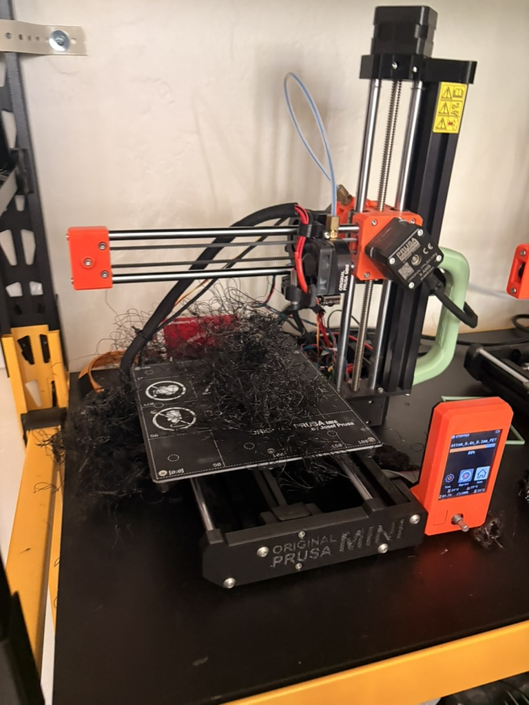

# Wedge Bottom Split Print and Printer Workaround, 2026-09-23

> **Summary** — The EPIC lab's medium Prusa failed, and a single wedge bottom takes over a day
> to print. John rigged a filament workaround on the medium Prusa, split the lean v5 wedge
> bottom CAD into two parts, and started the first half on a Prusa Mini. First layers were
> poor: some nozzle drag, and filament-feed resistance starved the bottom-layer infill for a
> stretch. The print was left running. **Outcome, 2026-09-24: the Prusa Mini prints failed** (see
> [Outcome](#outcome-2026-09-24)). Wedges printed on the larger printer came out well once
> PTFE-tube feed resistance was fixed. Tracked on
> [SCO-111](https://linear.app/scout1/issue/SCO-111).

---

## Printer status

| Machine | Location | State, 2026-09-23 |
|---|---|---|
| Medium Prusa | EPIC lab | **Failed, running on a workaround.** Its filament feeder had already been bypassed before today. John bypassed it again and set up a rolling filament stand inside the printer enclosure. Described by John as "sketchy but appeared to work". Not a proper repair; fix tracked on [SCO-114](https://linear.app/scout1/issue/SCO-114) |
| Prusa Mini | EPIC lab | Printing wedge-bottom half 1 |
| Large lab printer | — | Offline since the power-supply swap ([SCO-63](https://linear.app/scout1/issue/SCO-63)) |

**Why it matters:** each full wedge bottom takes over a day to print, and the buoy needs six
(one per 60° wedge). With the medium Prusa unreliable and the large printer offline, the
lab can't produce the flotation ring at the planned rate.

## CAD change: wedge bottom split in two

John split the [lean v5 wedge bottom](../cad/floatation/README.md#lean-wedge-bottom-v5--2026-09-10)
into two parts so each fits and finishes on a smaller printer.

**Split location (confirmed by John, 2026-09-23):** a single clean radial cut down the center
of the 60° segment, running from the outer radius to the inner radius. This gives two
matching 30° halves. The cut is plain, with no overlap, tab, or key, so the halves meet at a
flat butt joint.

**Not yet recorded:**

- **How the halves join.** Epoxy, bolts, or both. A flat butt joint has no mechanical
  interlock, so the bond carries everything.
- **STEP export of the halves.** Not committed yet. The committed
  `chassis-floatation-bolted-v5-wedge-bottom.step` is still the one-piece part.

**Open question: permanent design or print workaround?** The wedge bottom is the waterline
impact cap, and the impact analysis (Scenario C) relies on it being the thick part of the
shell. A seam through it adds a new leak path and a new weak line. The one-piece part is the
baseline until the team decides otherwise.

## First-half print observations

- **Bottom-layer quality was poor.** There was some nozzle dragging on the first layers.
- **Feed resistance.** At one point filament resistance stopped it feeding smoothly, which
  under-fed the bottom-layer infill.
- **Left running.** The part may come out with a weak or porous bottom skin, which is the
  underwater face.

## To check on 2026-09-24

- [x] Did the print finish? **No. It failed** (see below).
- [ ] Is the bottom skin continuous? Not applicable, no usable part.
- [ ] Printed mass of the half. Not available, still owed on SCO-111.
- [ ] Record the Mini's settings and print time for the half. Not recorded.

## Outcome, 2026-09-24

**Prusa Mini: failed, repeatedly.** John tried several times. Every attempt failed, ending in
the spaghetti mess in the photo below. Problems John saw:

- **Bed adhesion.** Parts would not stay stuck to the sheet.
- **Z calibration off.** First-layer height was wrong, which fits the nozzle drag seen on
  2026-09-23.
- "Many issues" beyond those two. Not broken down further.

The Mini is **not usable for wedge parts** until it is recalibrated. No usable split half
exists yet.

**Larger printer: wedges printed pretty well.** John reported that the larger printer turned
out good wedge prints. Filament met resistance in the PTFE tubes, and John fixed that.

**Not yet recorded:**

- Which larger printer this was. The medium Prusa on its workaround is assumed, since the
  large lab printer is offline ([SCO-63](https://linear.app/scout1/issue/SCO-63)).
- Whether it printed full one-piece wedge bottoms, split halves, or wedges.
- How the PTFE-tube resistance was fixed, and whether that fix closes
  [SCO-114](https://linear.app/scout1/issue/SCO-114).
- Print time and printed mass of the parts.

**What this means for the split.** The split existed only to fit the Mini. With the Mini
failing and the larger printer working, the one-piece wedge bottom stays the baseline. The
open question on SCO-111 is now weaker, because the split has no working printer.
